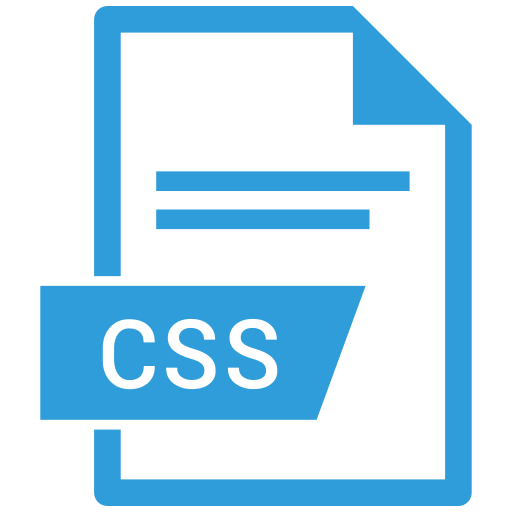

# Hi, 👋 I'm Leo

### Welcome to my Github profile! :octocat:

✔️ Feel free to take a look 
✔️ Contribute with me 
✔️ Or just exchange knowledge 💡 
🚀 We always learn something when we teach 🚀 

## About me 🦊

- 📚 Full Stack Web Developer, graduated from @<a href="https://www.cubos.academy/" target="_blank">Cubos Academy</a> in December 2022 🚀
- 📚 Improving my knowledge every day with hard work and practice 🚧 ALWAYS IN DEVELOP 🚀🚧
- 📚 I currently work as a freelancer together with a designer, developing sales pages, capture pages and web sites.
- 💭 I'm addicted to  💻, 🏋️‍♂️, ⚽ and 🎼.
- 💭 I love playing 🎮, learning new technologies 🧠 and play with my :dog: .
- 💭 I am a fan of Linux🐧 and love the concept of open source!
- ⚡ I love 70's rock and roll style 🎸.
- ⚡ My favorite phrase are:

  > "We are who we can be, dreams we can have" - Engenheiros do Hawaii

 

## 🛠️ I am currently working with ...
## Front-end:

 

## Back-end:

 
 

## 📚 And learning ...

 

 
 

 
 

